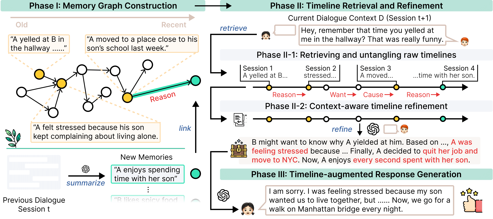

# Towards Lifelong Dialogue Agents via Timeline-based Memory Management  
🏆 Accepted at **NAACL' 25**

[](https://arxiv.org/abs/2406.10996)
[](https://huggingface.co/datasets/LangAGI-Lab/teafarm)
[](https://huggingface.co/spaces/ResearcherScholar/Theanine)
---

## Overview


- We present **THEANINE**, an LLM-based framework with a relation-aware memory graph
and timeline augmentation for long-term conversations.
- **THEANINE** outperforms representative baselines across automatic, LLM-based, and human evaluations of RG.
- We present **TeaFarm**, a counterfactual-driven pipeline evaluating agent performance in referencing the past without human intervention.

---

## Teafarm Evaluation

- In TeaFarm, we proceed to “trick” dialogue agents into generating incorrect responses, and agents must correctly reference past conversations to avoid being misled by us.

---

## Inference with Theanine

You can perform inference with Theanine in the following three phases:


### Phase I: Memory Graph Construction

```bash
python src/summarize.py
python src/memory_constructor.py # relation-aware memory linking
```

### Phase II and III: Timeline Refinement and Timeline-Augmented Response Generation

```bash
python src/theanine.py
```

To execute the full pipeline end-to-end:
```
bash scripts/theanine.sh
```

---

## Citation
```
@inproceedings{ong2025towards,
  title={Towards Lifelong Dialogue Agents via Timeline-based Memory Management},
  author={Ong, Kai Tzu-iunn and Kim, Namyoung and Gwak, Minju and Chae, Hyungjoo and Kwon, Taeyoon and Jo, Yohan and Hwang, Seung-won and Lee, Dongha and Yeo, Jinyoung},
  booktitle={Proceedings of the 2025 Conference of the Nations of the Americas Chapter of the Association for Computational Linguistics: Human Language Technologies (Volume 1: Long Papers)},
  pages={8631--8661},
  year={2025}
}
```